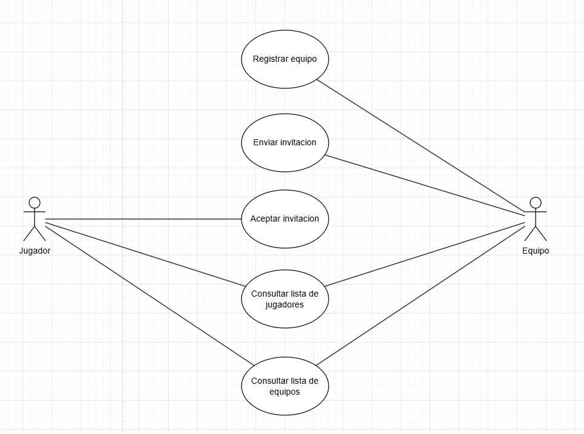
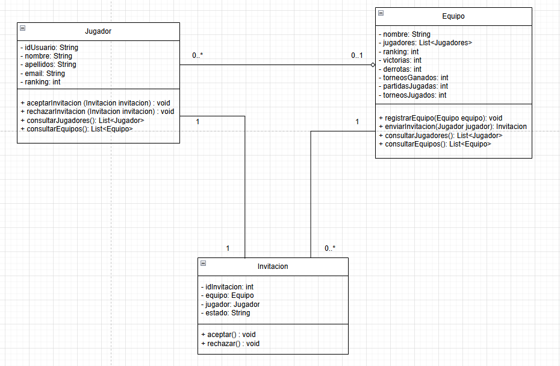

# SISTEMA DE GESTION DE TORNEOS DE ESPORTS
## 1. Analisis del problema y requisitos del sistema
El ejericicio propone la creación gestor de torneo de eSports. La aplicación permitirá a los usuarios registrados consultar rankings, torneos disponibles y equipos a los que podrán unirse. Los equipos, por su parte, dispondrán de funcionalidades para gestionar su plantilla de jugadores y gestionar su participación en los distintos torneos. 
El sistema contará con la figura del administrador, responsable de la creación y configuración de torneos y partidas, estableciendo sus normas. Asimismo, gestionará la verificación de usuarios y equipos mediante confirmación por correo electrónico, actualizará los resultados de las partidas y realizará la asignación de premios.

---

### 1.1 Actores que interactúan con el sistema

#### - Jugador

Tras completar el proceso de registro, el jugador podrá acceder a las estadísticas de los distintos equipos y consultar el ranking de jugadores.  
Para participar en un torneo será requisito formar parte de un equipo, siendo necesaria una invitación por parte del equipo.

#### - Equipo

Mediante el acceso a su cuenta, el equipo podrá autogestionar su plantilla, invitando o eliminando jugadores.  
También contará con la opción de inscribirse en torneos o abandonarlos según convenga.

#### - Administrador

Tiene la responsabilidad de gestionar el funcionamiento general del sistema, incluyendo la verificación de la identidad de jugadores y equipos, así como la configuración de torneos y partidas.  
Además, es el encargado de validar resultados y asignar premios conforme a las normas establecidas.

---

### 1.2 Funcionalidades del sistema

#### Funcionalidades para el jugador

- **Registro de cuenta de jugador**  
  Permitir el registro mediante formulario y verificación por correo electrónico.

- **Inicio de sesión**  
  Autenticación mediante usuario y contraseña.

- **Consulta de estadísticas**  
  Acceso a estadísticas personales y de los distintos equipos disponibles en la plataforma.

- **Visualización de torneos y rankings**  
  Consulta de torneos activos, pasados y rankings de jugadores (leaderboards).

- **Solicitud de ingreso a equipos**  
  Posibilidad de enviar solicitudes para unirse a un equipo existente.

- **Gestión de perfil**  
  Modificación de datos personales y configuración de privacidad.

---

#### Funcionalidades para el equipo

- **Creación de cuenta de equipo**  
  Permitir el registro de nuevos equipos, incluyendo nombre, logo y descripción.

- **Gestión de jugadores**  
  - Invitar jugadores a unirse al equipo.  
  - Aceptar o rechazar solicitudes de ingreso.  
  - Expulsar jugadores.

- **Inscripción en torneos**  
  Posibilidad de registrar al equipo en torneos disponibles.

- **Abandono de torneos**  
  Funcionalidad para retirarse de un torneo antes de que comience.

- **Consulta de estadísticas del equipo**  
  Visualización de resultados, historial de torneos y rendimiento de jugadores.

---

#### Funcionalidades para el administrador

- **Gestión de usuarios y equipos**  
  Verificación manual de nuevos registros.  
  Habilitación o bloqueo de cuentas.

- **Creación y configuración de torneos**  
  Definición de las normas del torneo, número de participantes, formato (formato suizo, bracket de eliminación, etc.), fechas y premios.

- **Creación de partidas**  
  Programación de enfrentamientos entre equipos dentro del torneo.

- **Actualización de resultados**  
  Introducción manual o validación automática de resultados de partidas.

- **Asignación de premios**  
  Registro de premios según clasificación final de los torneos.

- **Gestión del contenido**  
  Moderación de comentarios, noticias, foros y otros contenidos generados por los usuarios.

---

## 2. Elaboración del diagrama de casos de uso

Diagrama para el apartado 1

---

## 3. Identificación de las clases y relaciones
- **Jugador**
Un jugador puede no estar asociado a ningún equipo, manteniendo acceso únicamente a funcionalidades básicas del sistema, como la consulta de jugadores y equipos.  Para poder participar en torneos debe estar unido a un equipo, por lo tanto , la relacion es 0..1.
Asimismo, cada jugador podrá aceptar una única invitación para unirse a un equipo. Si desea aceptar otra, deberá abandonar previamente su equipo actual.
Si el jugador decide abandonar el equipo, puede unirse a otro que le haya invitado, estableciendo asi una relación de agregación entre jugador y equipo.
- **Equipo**
Cada cuenta de equipo puede no tener jugadores. En ese caso, solo podrá acceder a ciertas funciones del sistema. Para participar en torneos, al igual que los jugadores, será necesario que cuente con una cantidad mínima de jugadores. Por eso, la relación es 0...
Por otra parte, los equipos pueden decidir no enviar ninguna invitación o enviar todas las que deseen a varios jugadores, relación 0..*
- **Invitación**
 Cada invitación es única por jugador, y un jugador solo puede aceptar una a la vez. Para aceptar una nueva invitación, deberá desvincularse de su equipo actual. Esto define una relación 1..1 entre jugador e invitación.
Cada invitación está asociada de forma exclusiva a un único equipo.

---

## 4. Creación del diagrama de clases UML

---

## 5. Justificación del sistema
La elección de este sistema se basa en el diseño de una plataforma orientada a un entorno más profesional, en la cual son los equipos quienes deciden qué jugadores formarán parte de su plantilla, evitando así la recepción de solicitudes no deseadas por parte de los usuarios.

Además, el sistema incorpora funcionalidades para aquellos usuarios que aún no pertenecen a un equipo, permitiéndoles consultar estadísticas de los diferentes equipos y visualizar su posición en el ranking de jugadores, lo que favorece la visibilidad de los perfiles con mejor rendimiento.

En una versión más desarrollada del sistema, se contemplaría la inclusión de figuras administrativas con capacidades de regulación de partidas y torneos, verificación de resultados, validación de jugadores (para prevenir prácticas fraudulentas) y control de equipos (para evitar la duplicación de nombres o identidades).

---

📄 **Autor:** Álvaro Postigo Jiménez  
🎓 **Curso:** 1º DAW